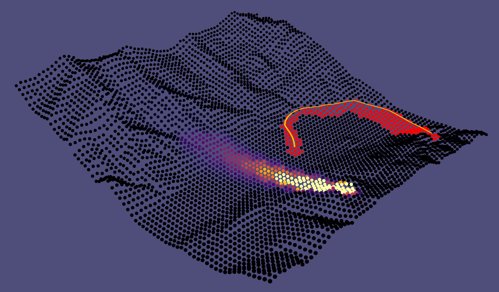

# Simulation Environment for Radiation Mapping with UAV

This repository provides a simulation environment for evaluating UAV/Helicopter strategies in mapping radiation over a geographic area while avioiding radiation that is too strong, designed for reinforcement learning and compatible with Gymnasium.

## Simulation Overview

The simulation models a UAV exploring a target area, measuring radiation, and updating its knowledge of the environment. At each step, the UAV moves, measures radiation, and updates the measured area. The environment tracks time and episode progress. The reward is based on radiation exposure, area newly measured, and penalties for too many turns, as implemented in the step and reward logic across `class_env.py`, `class_heli.py`, `class_sim.py`, and `class_gymenv.py`.

## Description in Paper

A detailed description of the simulation environment, methodology, and experimental results will be available in our paper (link will be provided as soon as published at IJCAI 2025).

## Video Demo

A video demonstration of the environment and its features will be supplied (link will be provided as soon as published at IJCAI 2025).
